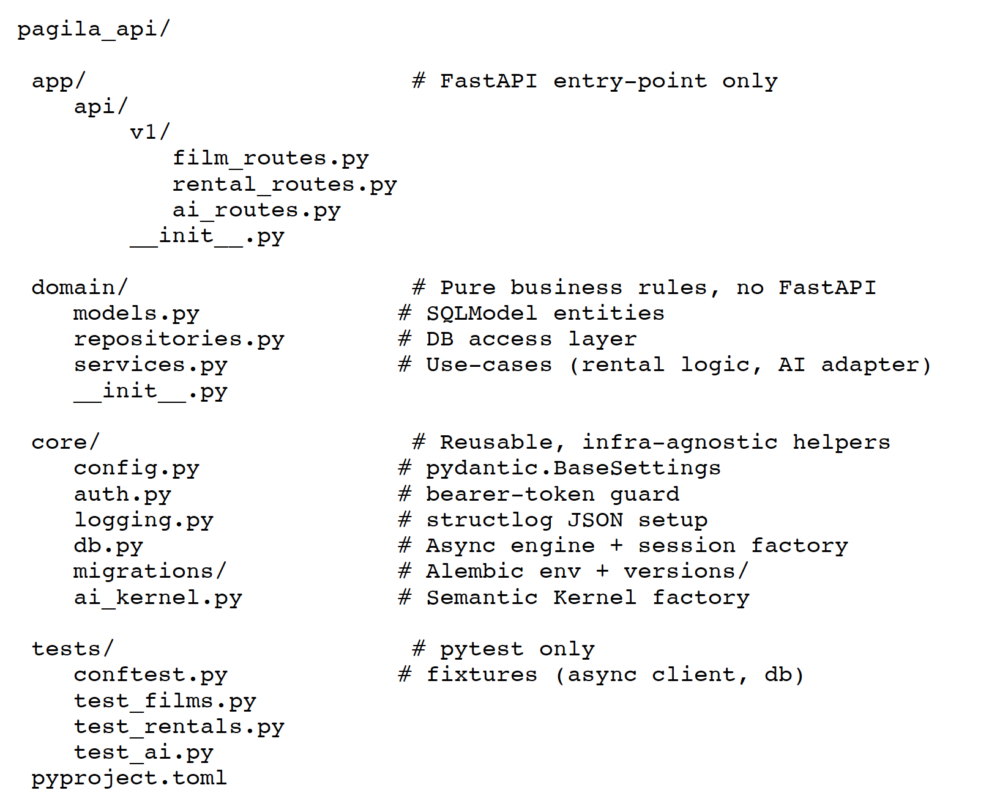

# Gen AI Readiness Assignment : Mini Pagila API

## Phase 1 :

### What you will build

#### Layer – Mandatory items

**Database Migrations**

- **Migration #1**  
  Add `streaming_available BOOLEAN DEFAULT FALSE` to `film`.

- **Migration #2**  
  Create `streaming_subscription (id, customer_id FK, plan_name, start_date, end_date)`.

**CRUD Endpoints (async)**

- `GET /films` – paginated list, optional filter `?category=`.
- `POST /customers/{id}/rentals` – create new rental (`inventory_id`, `staff_id`, `rental_date=now()`); Bearer token =dvd_admin required.

**Semantic Kernel Endpoints**

- `GET /ai/ask?question=` – basic chat-completions call; stream plain text.
- `POST /ai/summary`  
  Body: `{ "film_id": 1 }`  
  Returns structured JSON with keys `title`, `rating`, `recommended` (true/false).  
- Use **SK** `response_format={"type":"json_object"}` or JSON-Schema plugin so the LLM must respond in JSON.

**Tests**

- One happy-path `pytest` per endpoint using `httpx.AsyncClient` (async test style).

**Auth & DI**

- Implement FastAPI `OAuth2PasswordBearer` token guard.
- Share an `AsyncSession` via dependency injection.

**Environment Rule**

- Python 3.12.x via `pyenv`, project deps via `Poetry`.

---

### Detailed Guidance

#### 1. Database & migrations
- Restore Pagila ([pagila-schema.sql](https://github.com/devrimgunduz/pagila), [pagila-data.sql](https://github.com/devrimgunduz/pagila)) into PostgreSQL 12.
- Init Alembic once (`alembic init migrations`).
- Migration #1 adds Boolean column with default ([PostgreSQL defaults](https://www.postgresql.org/docs/current/ddl-default.html)).
- Migration #2 creates `streaming_subscription` table ([Alembic create_table helper](https://alembic.sqlalchemy.org/en/latest/ops.html)).
- Use `--autogenerate` to compare SQLModel metadata and DB schema ([docs](https://alembic.sqlalchemy.org/en/latest/autogenerate.html)).

#### 2. FastAPI + SQLModel (async)
- Follow SQLModel’s [dependency-injection recipe](https://sqlmodel.tiangolo.com/tutorial/fastapi/session-with-dependency/) for an `AsyncSession`.
- CRUD handlers: `async def`, `await session.exec(select(...))` ([tutorial](https://testdriven.io/blog/fastapi-sqlmodel/)).
- Protect POST with OAuth2PasswordBearer (hard-coded check `dvd_admin`).

#### 3. Semantic Kernel tasks
**Kernel setup**
```python
kernel = (
    KernelBuilder()
    .add_text_completion_service("openai", model_id="gpt-4o-mini", api_key=os.getenv("OPENAI_API_KEY"))
    .build()
)
```
**/ai/ask Endpoint**

Description: Simple chat endpoint; stream plain text chunks back to the client.

Implementation:
```python
# Example usage
await kernel.invoke("chatbot", input=question)
# or use streaming
TextIteratorStreamer / manual async yield
```
[OpenAI chat streaming reference.](https://platform.openai.com/docs/api-reference/realtime-server-events/response/content_part/done?utm_source=chatgpt.com)

**/ai/summary endpoint**
Description: Return structured JSON with keys: title, rating, recommended.

Implementation:
```python
resp = await kernel.invoke(
    "summarize_tool",
    input=film_text,
    execution_settings=configure_response_format({"type": "json_object"})
)
return resp.content
```

Prompt idea:
“You are an API returning strictly JSON with keys title, rating, recommended. Recommend true if rating > PG-13 and rental_rate < 3.00.”

#### 4. Testing

Use `pytest-asyncio` + `httpx.AsyncClient`. FastAPI async-test guide here: [fastapi.tiangolo.com](https://fastapi.tiangolo.com/advanced/async-tests/?utm_source=chatgpt.com)

Seed a tiny in-memory test DB or point to a disposable Postgres schema.

---

### Acceptance Rubric (100 pts)

| Area                                       | Points |
|--------------------------------------------|--------|
| Two Alembic migrations run cleanly          | 15     |
| GET `/films` (pagination + filter)          | 15     |
| POST `/customers/{id}/rentals` token-protected | 15  |
| `/ai/ask` streams plain answer              | 15     |
| `/ai/summary` returns valid JSON schema     | 15     |
| Async SQLModel + DI correctly used          | 10     |
| All four pytest cases pass                  | 10     |
| Clear `README` & `.env.example`             | 5      |

---

### Deliverables
- Bitbucket repo with code written during the session.  
- `README.md` showing `pyenv`, `poetry install`, database restore, migration commands, and example `cURL` calls for each endpoint.  
- `tests/` directory with four passing tests.

### Tech Stack

| Layer / Concern          | Tool / Library (Pin or Version Range) | Purpose / Why It’s Included |
|--------------------------|----------------------------------------|-----------------------------|
| Runtime & Environment    | Python 3.12 (install via `pyenv`)      | Matches prod image; pyenv keeps system Python untouched |
|                          | Poetry 1.8+                            | Virtual-env + deterministic poetry.lock |
|                          | Pydantic BaseSettings                  | Type-safe env-var & `.env` loading |
| Web Framework            | FastAPI                                | Async HTTP + DI + OpenAPI docs |
| Auth                     | OAuth2PasswordBearer (FastAPI)         | Simple Bearer-token guard (`dvd_admin`) |
| ORM / DB Driver          | SQLModel (SQLAlchemy 2, async)         | Declarative models, async queries |
|                          | asyncpg                                | High-perf Postgres driver |
| Database & Migrations    | PostgreSQL 15 + Pagila sample dump     | Real-world schema/data |
|                          | Alembic                                | Two schema revisions to implement tasks |
| AI / LLM                 | Semantic Kernel + OpenAI SDK           | `/ai/ask` & `/ai/summary` endpoints |
| Logging                  | structlog (JSON renderer)              | Machine-parsable logs |
| Tests                    | pytest + pytest-asyncio                | Unit & async HTTP tests |
|                          | httpx.AsyncClient                      | Call FastAPI app in tests |

---

### Best Practices

#### 1. Project layout — “vertical slice + shared lib”



*Why this shape?*

- Vertical slice folders (service layer) keep route, schema, service, repo changes together, reducing merge conflicts.  
Example: [`film_routes.py`](https://github.com)

- The `core/` folder centralizes imports so every future micro-worker can import `core.logging` and get the same auth, logging, migrations, schemas, and DB factories setup. (See [example](https://medium.com))

#### 2. Separation of concerns

##### 2.1 Controllers are thin

```python
# app/api/v1/film_routes.py
@router.get("/films")
async def list_films(q: FilmQuery = Depends(), svc: FilmService = Depends()):
    return await svc.list_films(q)
```

All logic lives in **FilmService**. Routes only:

- Validate input (Pydantic DTO).
- Inject dependencies.
- Return serialized DTO.

This mirrors the **service-layer / controller split** recommended in SOLID & Clean-Architecture articles ([Medium reference](https://medium.com/%40amirm.lavasani/how-to-structure-your-fastapi-projects-0219a6600a8f)).

---

##### 2.2 Dependency-injected services

```python
async def get_film_service(repo: FilmRepository = Depends(get_film_repo)):
    return FilmService(repo)
```
- Makes unit tests trivial (pass a fake repo).
- Aligns with FastAPI DI docs [FastAPI best practices](https://github.com/zhanymkanov/fastapi-best-practices?utm_source=chatgpt.com)

#### 3. Reusable Infrastructure

##### Concern: Best-practice snippet

| Concern          | Best Practice snippet | Source |
|--------------------------|----------------------------------------|-----------------------------|
| Auth    |OAuth2PasswordBearer` that checks token against env var in `core.auth` — import once everywhere.       | [Reddit discussion](https://www.reddit.com/r/FastAPI/comments/1b55e8q/how_to_structure_fastapi_app_so_logic_is_outside/) |
| Logging                      | `core.logging.configure()` sets structlog + correlation IDs; emit JSON for ELK parsing.                              | [Structlog best practices](https://www.structlog.org/en/stable/logging-best-practices.html) |
| DB                  | One async `Engine` in lifespan; sessions injected per request.                    | [TestDriven FastAPI + SQLModel](https://testdriven.io/blog/fastapi-sqlmodel/?utm_source=chatgpt.com) |
| Migrations |Two Alembic revisions live in `core/migrations/versions/`; autogenerate to prevent drift.  | [GitHub FastAPI best practices](https://github.com/zhanymkanov/fastapi-best-practices?utm_source=chatgpt.com) |
| Schemas | Input/Output DTOs (`FilmDTO`, `RentalDTO`) under `domain.models` — never inside route files.  | [Medium article](https://medium.com/%40amirm.lavasani/how-to-structure-your-fastapi-projects-0219a6600a8f?utm_source=chatgpt.com) |
| Tests | `tests/conftest.py` spins a test DB once; tests call `httpx.AsyncClient`. | [FastAPI async tests](https://fastapi.tiangolo.com/advanced/async-tests/?utm_source=chatgpt.com)
| AI Kernel | One factory (`core.ai_kernel.get_kernel()`) returns a pre-configured SK instance, reused by both AI endpoints. |[MS Learn Semantic Kernel docs](https://learn.microsoft.com/en-us/python/api/semantic-kernel/semantic_kernel.agents.open_ai.openaiassistantagent?view=semantic-kernel-python&utm_source=chatgpt.com)

---

#### 4. Semantic Kernel Endpoints — Extended Spec

##### Endpoint Behavior & Hints

###### `GET /ai/ask`
- Query param: `question`
- Stream plain text chunks from:  
  ```python
  await kernel.invoke_stream_async("chatbot", input=question)
  ```
  Handle as text/event-stream
- Use SK’s stream helper or manual async generator
- Source: [BetterStack article](https://betterstack.com/community/guides/logging/structlog/)

###### `POST /ai/summary`
- Body: { "film_id": int }
- Look up film via service layer, then:
```python
resp = await kernel.invoke("summarize_tool", input=film_text, execution_settings={"response_format":{"type":"json_object"}})
```
- Return resp.content JSON
- Follows new OpenAI response_format feature [Understanding the kernel](https://learn.microsoft.com/en-us/semantic-kernel/concepts/kernel?utm_source=chatgpt.com&pivots=programming-language-python)

**Prompt folder** (core/prompts/summary/) keeps config.json + .skprompt so prompts are version-controlled.

#### 5. Coding & CI Conventions

- **Type hints & mypy** — CI fails on warnings.  
```bash
  poetry add -G dev mypy ruff
```
- **Commit hooks** via pre-commit (black, ruff, mypy).
- ** .env only for non-secret defaults**; secrets injected via Docker/CI.
- **Pytest markers**: @pytest.mark.asyncio for async tests (official FastAPI recipe). [fastapi.tiangolo.com](https://fastapi.tiangolo.com/advanced/async-tests/)
- **No business logic** in migrations—use data-migration scripts if needed.
- **No blocking I/O** in services; always await DB or network ops (asyncpg, SK).
- **Structured logs only** (JSON) in prod; human readable in dev (structlog processors). [betterstack.com](https://betterstack.com/community/guides/logging/structlog/?utm_source=chatgpt.com)